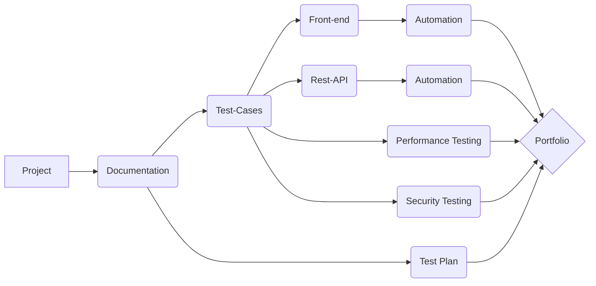

"Portfolio_Project" for _Spotify Web Player_

$${\color{lightblue}FRONT-END\space **PYTHON**\space and \space **SELENIUM \space WEB\space DRIVER**\space  }$$

$${\color{lightgreen} REST-API \space JAVA-SCRIPT \space POSTMAN }$$

# Languages and Tools 

### Connect with me : 

### Selenium 
[DOM](https://github.com/olxovsky/QA_Portfolio/blob/main/02_Selenium%20WebDriver/UnitTest/helpers.py)

[Script](https://github.com/olxovsky/QA_Portfolio/blob/main/02_Selenium%20WebDriver/UnitTest/Spotify_Web_player_UnitTest.py)

[Allure Report](https://github.com/olxovsky/QA_Portfolio/blob/main/02_Selenium%20WebDriver/AllureReport/Allure_Report_Spotify_WebPlayer_UnitTest.url)

[HTML Report 1](https://github.com/olxovsky/QA_Portfolio/blob/main/02_Selenium%20WebDriver/HtmlReports/TestResults___main__.Chrome_Spotify_Web_Player_2022-11-13_17-57-05.html)

[HTML Report 2](https://github.com/olxovsky/QA_Portfolio/blob/main/02_Selenium%20WebDriver/HtmlReports/TestResults___main__.Edge_Spotify_Web_Player_2022-11-13_17-57-05.html)

[HTML Report 3](https://github.com/olxovsky/QA_Portfolio/blob/main/02_Selenium%20WebDriver/HtmlReports/TestResults___main__.Firefox_Spotify_Web_Player_2022-11-13_17-57-05.html)

### **Performance Testing**
[GTmetrix](https://github.com/olxovsky/QA_Portfolio/blob/main/03_Performance%20Test/Performance_Test_GTmetrix-report-open.spotify.com.pdf)

### **Security Testing**

[Mozilla Observatory](https://github.com/olxovsky/QA_Portfolio/blob/main/04_Security%20Testing/Mozilla%20Observatory%20__%20Scan%20Results%20for%20open.spotify.com.pdf)

[Snyk](https://github.com/olxovsky/QA_Portfolio/blob/main/04_Security%20Testing/Security%20Analysis%20for_%20open.spotify.com_%20Snyk.pdf)

### **Documentation**

[Test Plan](https://github.com/olxovsky/QA_Portfolio/blob/main/Test%20Plan%20Spotify%20Web%20Player.pdf)

[Test Cases](https://github.com/olxovsky/QA_Portfolio/blob/main/01_Documentation/Cross-browser%20Matrix%20and%20TC_Spotify.pdf)

